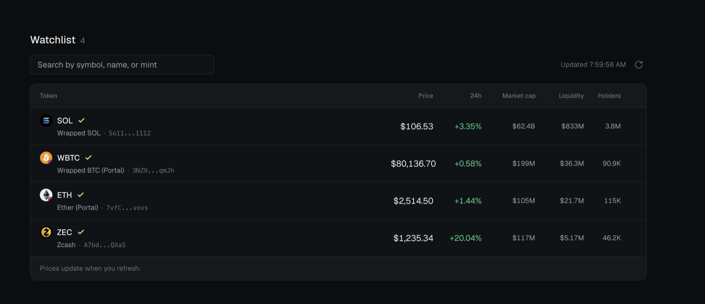
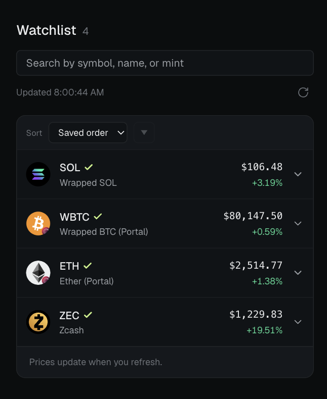

# Token Watchlist

A single-page Solana token watchlist: search for a token, add it, see its market data, remove it. The list survives a reload.

React 19 + TypeScript on Next.js 16 (App Router), Tailwind v4.

Deployed at <https://token-watchlist-sepia.vercel.app/>.

## Preview

**Desktop**



**Mobile**



## Run it

Requires Node 20.9+ and a Jupiter API key.

```bash
npm install
echo "JUPITER_API_KEY=your_key" > .env   # gitignored, server-side only
npm run dev                              # http://localhost:3000
```

`next dev` reads `.env` at startup, so restart it after changing the key.

| Command                           | Does                        |
| --------------------------------- | --------------------------- |
| `npm run dev`                     | Development server          |
| `npm run build` / `npm run start` | Production build and server |
| `npm run lint`                    | ESLint                      |
| `npm run typecheck`               | `tsc --noEmit`              |

There is no test script.

## Key Product Decisions

### Storage & freshness

- **Local storage holds identity and a `seeded` flag.** Mint, symbol, name and icon URL in saved order — everything that doesn't go stale.
- **Metrics are always fetched fresh.** A cached price is wrong the moment it's written, so price, market cap, liquidity and holders never persist.
- **Everything is keyed by mint, never symbol.** Jupiter returns tokens whose symbol and name are deliberate permutations of each other; symbol as a key adds the wrong one.
- **SOL is seeded on the first visit only.** "If the list is empty, add SOL" would resurrect it on every removal — an empty watchlist is a valid, deliberate state.

### Fetching

- **The whole watchlist loads in one request.** Jupiter's search endpoint accepts up to 100 mints, so refresh is atomic and every row is the same age.
- **Soft cap of ~50 tokens.** A direct consequence of the single-request design, and well above what one person actually monitors.
- **Snapshot at load, not a live feed.** A manual refresh button and an explicit `Updated 2:32:07 PM`

### Search behaviour

- **Results open a slot; they never cover the watchlist.** Floating a panel would hide a short list, and checking what you already hold is the reason it's on screen.
- **Debounced 250ms with an `AbortController`.** The last thing typed is always the thing rendered.
- **The slot is fixed to five rows and filled in every state.** Loading uses skeletons pinned to real row height, so results land without moving a single column edge.
- **Fewer than five matches ends with a muted `N matches · End of results` row.** Makes the remaining capacity explicit instead of padding the ranking with recommendations.

### Search ranking & filtering

- **Results are never re-sorted.** Jupiter's ranking already weighs verification, liquidity, volume and organic score; a two-bit rule layered on top could only lose information.
- **Rows with null liquidity are dropped, and `limit` is raised to 50.**
- **Mint queries skip both the filter and the limit.** Pasting an address names one exact token, and rehydration uses the same request shape.

### Adding & removing

- **The star is both the control and the indicator.** A badge that reports membership and a button that changes it are two things that can disagree; one target can't.
- **Adding reuses the token object search already returned.** The new row arrives complete without a second request, and the panel stays open with the query intact.
- **Removal is one click with no confirmation,** backed by an eight-second inline undo that restores the entry to its original position without refetching.

### Watchlist table (desktop)

- **The table reads as two tiers, not six equal columns.** Price and 24h change are the scan pair at 15px/14px; market cap, liquidity and holders drop to 12px secondary behind extra lead.
- **The card sizes to its rows.** One token is a short card; a fixed floor left 214px of blank surface reading as empty rows.
- **The empty state keeps the card and footer,** so emptying the list swaps a row for copy in place instead of dropping the footer down the page.
- **A long list scrolls the page with a sticky `<thead>`,** not a nested scrollbar — units live in the header labels and nowhere else.

### Watchlist accordion (mobile)

- **Below 640px the table becomes an accordion.** Between 480 and 640 the columns were technically present and practically unreachable.
- **The drawer answers whether the token still belongs on the list.** Market cap, liquidity and 24h volume lead in equal tabular cells; trust and context follow as chips.
- **Copying a mint lives here,** in a panel built with room for it, rather than as a third tap target on a search row.

### Sorting

- **Sorting is a view; the saved order never changes in storage.** A sort can't quietly become the thing the app remembers.
- **Each numeric header cycles descending → ascending → saved order.** Descending first because these are money columns; a third state so a sorted list has a way home short of a reload.
- **Mobile gets its own sort band:** a native `<select>` of the five keys plus Saved order, and a direction toggle disabled while unsorted. Native because the OS picker is the better target and costs no focus-trapping.

### Known limitations

- **The undo can expire off-screen.** It lives in the status strip beside the search input, which scrolls away on a long list; pinning it under a slot that expands 297px buys a fiddly problem for a narrow case.
- **The seeded SOL row shows a placeholder disc for a few hundred milliseconds** on first load, because storage isn't written back on refresh. Fixing it would reopen the removal race.
- **Two tabs are last-write-wins.** Fine for a list of favourites; crashing is not.

### Out of scope

Trading, wallet connection, charts, alerts, multiple watchlists, export, accounts, sync, and server-side persistence. One anonymous user, one watchlist, one device.

## Data source

[Jupiter Tokens API V2](https://dev.jup.ag/docs/tokens/v2) — `GET https://api.jup.ag/tokens/v2/search?query={query}`, authenticated with an `x-api-key` header.

The `query` parameter takes a symbol, a name, a mint, or a comma-separated batch of mints. Symbol and name searches default to 20 results and accept a `limit`; this app sends `limit=50`. Mint batches return up to 100 in one response and need no `limit`.

## Layout

```text
app/
├── api/tokens/route.ts  # The only route: validates the query, calls Jupiter
├── lib/tokens.ts        # Server-side Jupiter client and response normalization
├── lib/types.ts         # Token, TokenStats, WatchEntry
├── lib/api.ts           # Browser-side client for /api/tokens
├── lib/storage.ts       # localStorage: saved identities and the seeded flag
├── lib/format.ts        # Price, percent, compact USD, count, mint truncation and validation, liquidity threshold, 24h volume
├── lib/sort.ts          # Sort keys, the mobile menu's labels, and the comparator over the saved order
├── watchlist.tsx        # Client component: the entry list, metrics, undo, page layout
├── use-token-search.ts  # The search state machine: query, debounce, abort, dismissal, keyboard highlight
├── search-results.tsx   # The results panel: header, rows, empty and error states
├── token-table.tsx      # Picks the layout for one entry list, owns the open card and the sort
├── token-card.tsx       # Mobile: the accordion row and its drawer
├── token-row.tsx        # Desktop: one table row
├── page.tsx             # Server component shell
├── layout.tsx           # Root layout and metadata
└── globals.css          # Tailwind import and theme tokens

components/
├── star-button.tsx       # The add/remove toggle both row types use
├── token-icon.tsx        # Token icon with a fallback for missing and broken URLs
└── token-status.tsx      # Shared verified/unverified marker and launchpad tag
```

`AGENTS.md` is the working contract for coding agents in this repo — the same decisions stated as constraints, plus conventions and verification rules.
